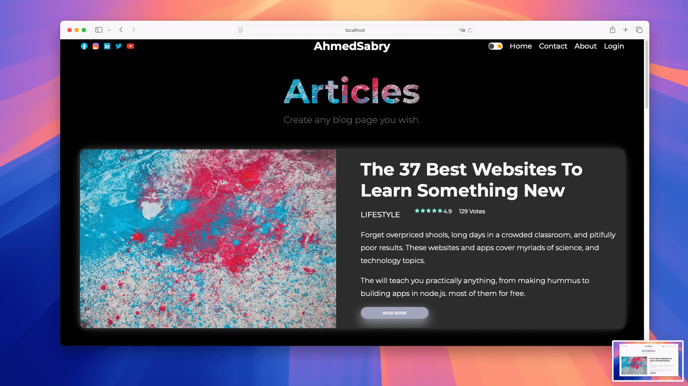
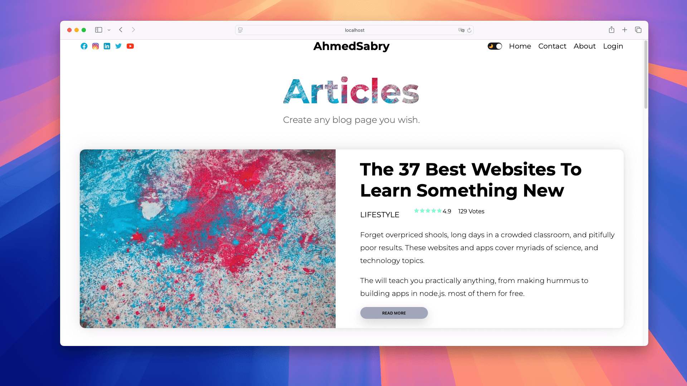
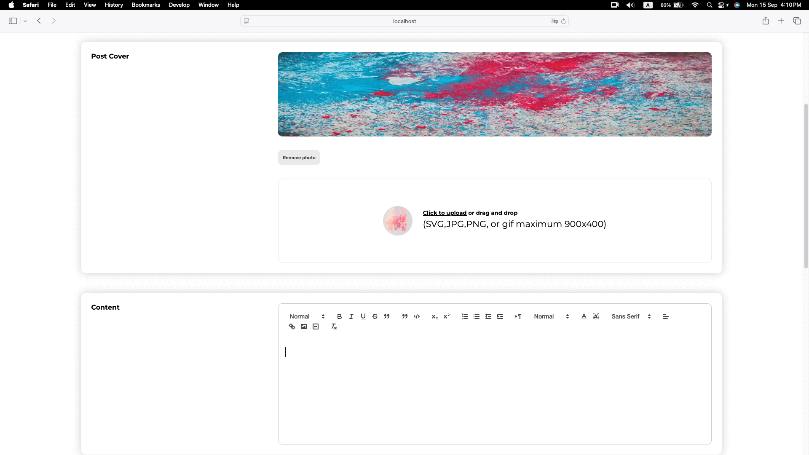
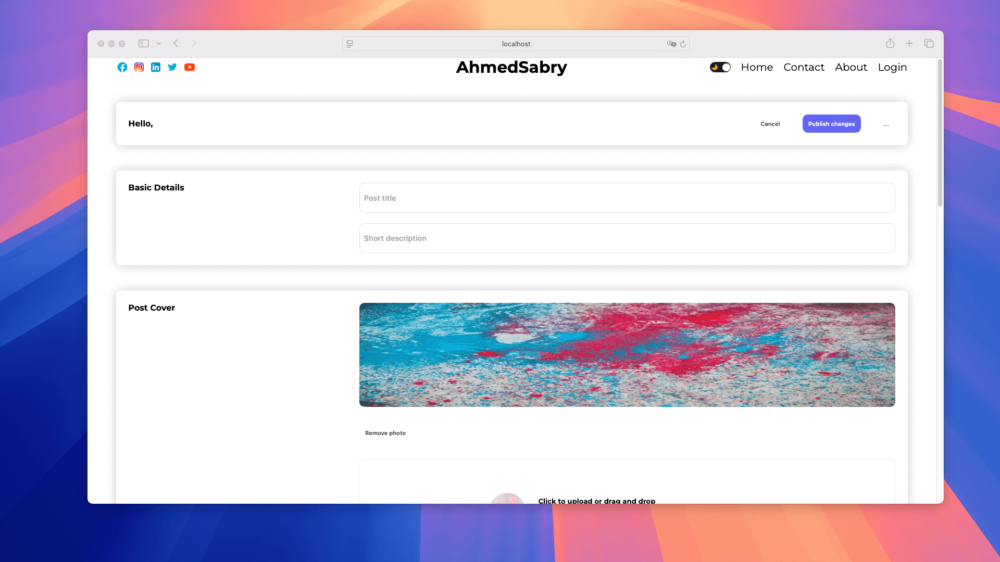
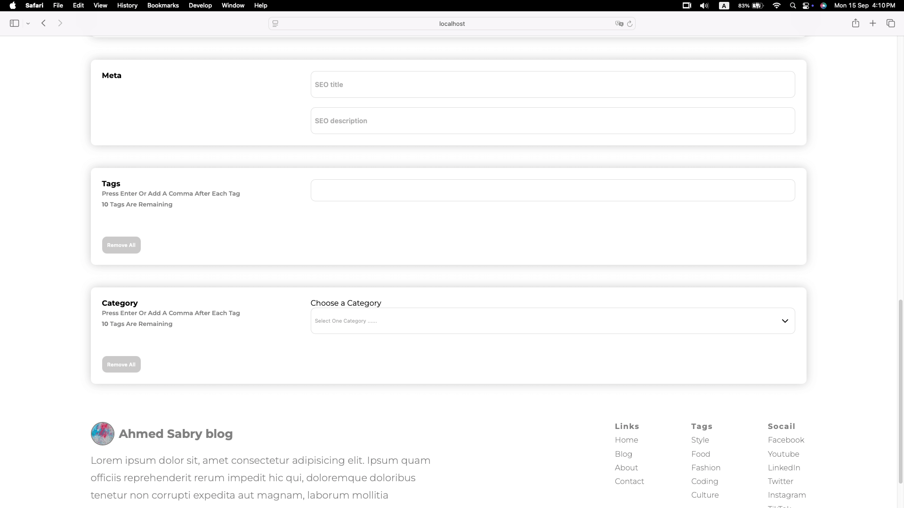

# 🚀 Fullstack Next.js Blog – Modern, Scalable, and Feature-Rich Blogging Platform



---

## 🌟 Overview

**Fullstack Next.js Blog** is a **cutting-edge, fullstack blogging platform** crafted for developers, content creators, and tech enthusiasts. Built with **Next.js 13**, **React 18**, **Prisma ORM**, **NextAuth**, and **Firebase**, it combines **performance, scalability, and developer-friendly architecture** with a **stunning, modern UI**.  

This platform supports **dynamic content management**, **rich text editing**, **media uploads**, and **advanced search & filtering**, making it the ultimate solution for professional blogging.

---

## ✨ Key Features

-  **Next.js 13 App Router** – Lightning-fast navigation and SSR
-  **Prisma ORM** – Robust, type-safe database management
-  **NextAuth Authentication** – Secure login with email, OAuth, and Prisma adapter
-  **Rich Text Editor (Quill)** – Support for images, videos, and rich formatting
-  **Firebase Media Uploads** – Upload images and media effortlessly
- 📂 **Dynamic Categories, Tags & Pagination** – Organize content efficiently
- 👤 **User Profiles & Avatars** – Personalize your blogging experience
- 💬 **Comment System** – Engage with readers directly
- 🌗 **Dark/Light Theme Toggle** – Seamless theme switching
- 🔗 **Social Media Integration** – Share content effortlessly
- 📱 **Fully Responsive Design** – Works flawlessly across devices
- 🔍 **Advanced Filtering & Search** – Find content instantly

---

## 🏗️ Project Architecture

```
app/           # Next.js core (pages, components, API routes)
components/    # Reusable React components
prisma/        # Prisma schema & migrations
public/        # Static assets (images, icons)
utils/         # Utility functions
styles/        # Global & modular CSS
context/       # React context providers
providers/     # Auth & Theme providers
```

Designed for **modularity, scalability, and maintainability**, making it **easy to extend and integrate** new features.

---

## ⚡ Getting Started

1. **Install dependencies**  
   ```bash
   yarn install
   # or
   npm install
   ```
2. **Configure environment variables**  
   Create a `.env` file for **database**, **NextAuth**, **Firebase**, and other secrets.  
3. **Run development server**  
   ```bash
   yarn dev
   # or
   npm run dev
   ```
4. **Setup Prisma**  
   ```bash
   npx prisma generate
   npx prisma migrate dev
   ```

---

## 🛠️ Available Scripts

- `dev` – Start development server  
- `build` – Build for production (includes Prisma generate)  
- `start` – Run production server  
- `lint` – Run code linter  

---

## 💻 Tech Stack & Tools

      

- **Next.js 13** – Modern React framework
- **React 18** – Component-based UI
- **Prisma ORM** – Database abstraction & migrations
- **NextAuth** – Secure authentication
- **Firebase** – Cloud storage for media uploads
- **React-Quill** – Advanced WYSIWYG editor
- **SWR** – Data fetching with caching & revalidation

---

## 📸 Screenshots

  
  
  
  

---

## 🏆 Advanced Features

- **Modular & Scalable Architecture** – Build large projects effortlessly
- **Professional UI/UX** – Engaging and clean design
- **SEO-Friendly & High Performance** – Optimized for speed and discoverability
- **Customizable & Extensible** – Add features with minimal effort
- **Secure & Reliable** – Built with best practices in authentication and data management

---

## 👨‍💻 Author

**Ahmed Sabry**  
📧 mrsabry134@gmail.com  
🌐 [Portfolio / LinkedIn]

---

## 📜 License

Licensed under the **MIT License** – free to use, modify, and distribute.  

---

## 🤝 Contributing

**Pull requests welcome!**  
For major changes, open an issue first to discuss improvements or features.  

---

## 📞 Contact

For questions, suggestions, or collaborations, reach out to **Ahmed Sabry** at **mrsabry134@gmail.com**.  

---

## 🙏 Acknowledgements

- [Next.js](https://nextjs.org/) – Framework  
- [Prisma](https://www.prisma.io/) – Database ORM  
- [Firebase](https://firebase.google.com/) – Cloud storage  
- [React](https://react.dev/) – Frontend library  
- [Quill](https://quilljs.com/) – Rich text editor  

---

✅ **Fullstack Next.js Blog** – where **scalability, speed, and professional blogging** meet.